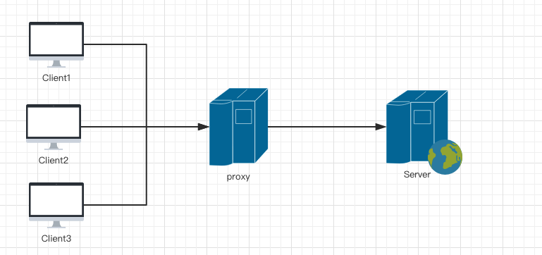
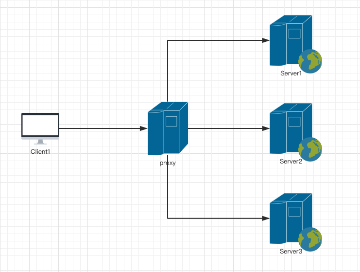

## 1.nginx简介

Nginx是一款轻量级的Web 服务器/反向代理服务器及。其特点是占有内存少，并发能力强，事实上nginx的并发能力确实在同类型的网页服务器中表现较好。Nginx常用作负载均衡服务，处理静态文件，反向代理等，中国大陆使用nginx网站用户有：百度、京东、新浪、网易、腾讯、淘宝等

## 2.nginx安装
下载必要组件
* nginx下载地址
        http://nginx.org/en/download.html     下载稳定版本 nginx-1.14.2
/home/reistlin/logs/proxy.access.log;
* pcre库下载地址，用于解析正则

        https://nchc.dl.sourceforge.net/project/pcre/pcre/8.42/pcre-8.42.tar.gz

* zlib下载地址，用来压缩文件
    
        http://www.zlib.net/zlib-1.2.11.tar.gz

* openssl下载地址，用来解析https协议
    
        https://github.com/openssl/openssl  下载 1_0_1版本

在同级目录下,解压安装zlib、openssl、pcre

进入nginx目录，进行配置安装，下面可直接复制粘贴

    ./configure --prefix=/usr/local/nginx --with-http_ssl_module --with-http_flv_module --with-http_stub_status_module --with-http_gzip_static_module --with-pcre=../pcre-8.42 --with-zlib=../zlib-1.2.11 --with-openssl=../openssl-OpenSSL_1_0_1r

**如果出现 ubuntu Invalid C++ compiler or C++ compiler flags 这个错误，请安装 sudo apt-get install g++**
编译安装

    $ make && sudo make install

Nginx会被安装在/usr/local/nginx目录下（也可以使用参数--prefix=指定自己需要的位置）， 安装成功后 /usr/local/nginx 目录下有四个子目录分别是：conf、html、logs、sbin 。 其中 Nginx 的配置文件存放于 conf/nginx.conf， bin文件是位于 sbin 目录下的 nginx 文件。 确保系统的 80 端口没被其他程序占用，运行 sbin/nginx 命令来启动 Nginx，

## 3.启动nginx

    $sudo /usr/local/nginx/sbin/nginx

打开浏览器访问此机器的 IP，如果浏览器出现 Welcome to nginx! 则表示 Nginx 已经安装并运行成功

## 4.nginx常用命令

        # 检查配置文件是否正确
        # /usr/local/nginx/sbin/nginx -t
        # 可以看到编译选项
        # /usr/local/nginx/sbin/nginx -V
        #重启Nginx
        #sudo /usr/local/nginx/sbin/nginx -s reload
        #关闭Nginx
        #sudo /usr/local/nginx/sbin/nginx -s stop
        #优雅停止服务
        #sudo /usr/local/nginx/sbin/nginx -s quit
        #kill -s SIGQUIT pid_master
        #kill -s SIGWINCH pid_master

## 5.正向代理
- 正向代理类似一个跳板机，代理访问外部资源。



> 正向代理 是一个位于客户端和原始服务器(origin server)之间的服务器，为了从原始服务器取得内容，客户端向代理发送一个请求并指定目标(原始服务器)，然后代理向原始服务器转交请求并将获得的内容返回给客户端。客户端必须要进行一些特别的设置才能使用正向代理。
- 正向代理的用途：
    - 访问原来无法访问的资源，如google
    - 可以做缓存，加速访问资源
    - 对客户端访问授权，上网进行认证
    - 代理可以记录用户访问记录（上网行为管理），对外隐藏用户信息

    ```
    server {
        resolver 202.99.192.68;    # 必需
        resolver_timeout 5s;
        # server_name    不需要

    # 监听端口
        listen 8888;

    access_log  /home/reistlin/logs/proxy.access.log;# 代理日志
    error_log   /home/reistlin/logs/proxy.error.log;

    location / {
        # 配置正向代理参数
        proxy_pass $scheme://$http_host$request_uri;
        # 解决如果URL中带"."后Nginx 503错误
        proxy_set_header Host $http_host;

        # 配置缓存大小
        proxy_buffers 256 4k;
        # 关闭磁盘缓存读写减少I/O
        proxy_max_temp_file_size 0;
         # 代理连接超时时间
        proxy_connect_timeout 30;

        # 配置代理服务器HTTP状态缓存时间
        proxy_cache_valid 200 302 10m;
        proxy_cache_valid 301 1h;
        proxy_cache_valid any 1m;
    }
    ```

## 6.反向代理
- 反向代理（Reverse Proxy）跟代理正好相反（需要说明的是，现在基本所有的大型网站的页面都是用了反向代理），客户端发送的请求，想要访问server服务器上的内容。发送的内容被发送到代理服务器上，这个代理服务器再把请求发送到自己设置好的内部服务器上，而用户真实想获得的内容就在这些设置好的服务器上。

- 反向代理的作用
  - 大型网站，通常将反向代理作为公网访问地址，Web服务器是内网
  

  - 负载均衡，通过反向代理服务器来优化网站的负载

  

## 7.配置

nginx.conf配置文件,基本就分为以下几块：

    main
    events   
    {
      ....
    
    }
    http        
    {
      ....
      upstream myproject 
    {
        .....
      
    }
      server  
    {
        ....
        location 
    {
            ....
        
    }
      }
      server  
    {
        ....
        location 
    {
            ....
        
    }
      }
      ....
    
    }

nginx配置文件主要分为六个区域：

* main(全局设置)
* events(nginx工作模式)
* http(http设置)
* sever(主机设置)
* location(URL匹配)
* upstream(负载均衡服务器设置)

### 7.1 main区域全局设置：
```
    #运行用户，默认即是nginx，可以不进行设置
    user  nginx;
    #Nginx进程，一般设置为和CPU核数一样
    worker_processes  1;
    #错误日志存放目录
    error_log  /var/log/nginx/error.log warn;
    #进程pid存放位置
    pid        /var/run/nginx.pid;
```

### 7.2 events 模块

events模块来用指定nginx的工作模式和工作模式及连接数上限，一般是这样：

    events 
    {
        use epoll;
        #Linux平台
        worker_connections  1024;
    ;
    }

use用来指定Nginx的工作模式。Nginx支持的工作模式有select、poll、kqueue、epoll、rtsig和/dev/poll。其中select和poll都是标准的工作模式，kqueue和epoll是高效的工作模式，不同的是epoll用在Linux平台上，而kqueue用在BSD系统中,对于Linux系统，epoll工作模式是首选。

worker_connections用于定义Nginx每个进程的最大连接数，即接收前端的最大请求数，默认是1024。最大客户端连接数由worker_processes和worker_connections决定，即Max_clients=worker_processes*worker_connections，在作为反向代理时，Max_clients变为：Max_clients = worker_processes * worker_connections/4。 进程的最大连接数受Linux系统进程的最大打开文件数限制，在执行操作系统命令“ulimit -n 65536”后worker_connections的设置才能生效。

### 7.3 http 模块

http模块可以说是最核心的模块了，它负责HTTP服务器相关属性的配置，它里面的server和upstream子模块，至关重要，等到反向代理和负载均衡以及虚拟目录等会仔细说。

    http
    {
      include       /etc/nginx/mime.types;    #文件扩展名与类型映射表
      default_type  application/octet-stream;  #默认文件类型
      #设置日志模式
      log_format  main  '$remote_addr - $remote_user [$time_local] "$request" ''$status $body_bytes_sent "$http_referer" ''"$http_user_agent" "$http_x_forwarded_for"';

      access_log  /var/log/nginx/access.log  main;   #nginx访问日志存放位置
      sendfile        on;   #开启高效传输模式
      #tcp_nopush     on;    #减少网络报文段的数量
      keepalive_timeout  65;  #保持连接的时间，也叫超时时间

        upstream myproject  #负载均衡配置
    {
            .....
        
    }
        server # 虚拟机配置
    {
            ....
        
    }
    }


### 7.4 server 模块

sever 模块是http的子模块，它用来定一个虚拟主机

基础的server配置

    server 
    {
            listen       8080;  #端口
            server_name  localhost 192.168.12.10 www.yangyi.com; #主机地址或IP


            root   /Users/yangyi/www; # 服务器根目录

            index  index.php index.md index.htm;  #默认首页

            charset utf-8; #字符集

            access_log  usr/local/var/log/host.access.log  main; #虚拟主机的访问日志存放路径

            aerror_log  usr/local/var/log/host.error.log  error;  #虚拟主机的访问错误日志存放路径

            location /{
               ....
            }


    
    }


### 7.5 location 模块
 根据它字面意思是用来定位的，定位URL，解析URL，所以，它也提供了强大的正则匹配功能，也支持条件判断匹配，用户可以通过location指令实现Nginx对动、静态网页进行过滤处理。

我们先来看这个，设定默认首页和虚拟机目录。

    location / 
    {
                root   /Users/yangyi/www #服务默认启动目录
    ;
                index  index.php index.md index.htm  #默认首页
    ;
            }

### 7.6  Location 正则表达式
```
    location [ = | ~ | ~* | ^~ ] uri { ... }
```
1. 等号（=）
表示完全匹配规则才执行操作
    ```
    location = /index {
        [ configuration A ]
    }
    URL为 http://{domain_name}/index 时，才会执行配置中操作。

    ```
2. 波浪号（~）
表示执行正则匹配，但区分大小写
    ```
    location ~ /page/\d{1,2} {
    [ configuration B ]
    }
    URL 为 http://{domain_name}/page/1 匹配结尾数字为1-99时，配置生效。
    ```
3. 波浪号与星号（~*）
表示执行正则匹配，但不 区分大小写
    ```
    location ~* /\.(jpg|jpeg|gif) {
    [ configuration C ]
    }
    匹配所有url以jpg、jpeg、gif结尾时，配置生效。
    ```
4. 脱字符与波浪号（^~）
表示普通字符匹配，前缀匹配有效，配置生效
    ```
    location ^~ /images/ {
    [ cofigurations D ]
    }
    URL 为 http://{domain_name}/images/1.gif 时，配置生效。
    ```

5. @
定义一个location，用于处理内部重定向
    ```
    location @error {
        proxy_pass http://error;
    }

    error_page 404 @error;
    ```
6. 优先级
    ```
    = > ^~ > ~/~*
    ```

## 8. 自定义错误页
当网站遇到页面没有找到的时候，我们要提示页面没有找到，并给用户可返回性。错误的种类有很多，所以真正的好产品会给顾客不同的返回结果。
1. 多个错误页面指向一个页面
    ```
    error_page   500 502 503 504  /50x.html;
    ```
2. 单独为错误置顶处理方式
    ```
    error_page 404  /404_error.html;
    ```
3. 把错误码换成一个地址
    ```
    error_page  404 http://www.sxuek.com
    ```

## 9. 访问设置
如果服务器只允许特定主机访问，需要控制一些IP访问，我们可以直接在location里进行配置。

    ```
    location / {
        deny   123.9.51.42; #拒绝
        allow  45.76.202.231;  # 允许
        deny  all; # 拒绝所有
        allow all; # 允许所有
    }
    ```

## 10. Nginx反向代理的设置
Client端和Server端之间增加一个提供特定功能的服务器，这个服务器就是我们说的代理服务器。
    ```
    server{
        listen 80;
        server_name localhost;
        location / {
               proxy_pass http://www.sxuek.com;
        }
    }
    ```

- 其它反向代理指令

反向代理还有些常用的指令，我在这里给大家列出：

proxy_set_header :在将客户端请求发送给后端服务器之前，更改来自客户端的请求头信息。

proxy_connect_timeout:配置Nginx与后端代理服务器尝试建立连接的超时时间。

proxy_read_timeout : 配置Nginx向后端服务器组发出read请求后，等待相应的超时时间。
proxy_send_timeout：配置Nginx向后端服务器组发出write请求后，等待相应的超时时间。
proxy_redirect :用于修改后端服务器返回的响应头中的Location和Refresh。

## 11. Nginx的Gzip压缩配置
Gzip是网页的一种网页压缩技术，经过gzip压缩后，页面大小可以变为原来的30%甚至更小。
    ```
    http {
    .....
    gzip on;
    gzip_types text/plain application/javascript text/css;
    .....
    }
    ```

Nginx提供了专门的gzip模块，并且模块中的指令非常丰富。

- gzip : 该指令用于开启或 关闭gzip模块。
- gzip_buffers : 设置系统获取几个单位的缓存用于存储gzip的压缩结果数据流。
- gzip_comp_level : gzip压缩比，压缩级别是1-9，1的压缩级别最低，9的压缩级别最高。压缩级别越高压缩率越大，压缩时间越长。
- gzip_disable : 可以通过该指令对一些特定的User-Agent不使用压缩功能。
- gzip_min_length:设置允许压缩的页面最小字节数，页面字节数从相应消息头的Content-length中进行获取。
- gzip_http_version：识别HTTP协议版本，其值可以是1.1.或1.0.
- gzip_proxied : 用于设置启用或禁用从代理服务器上收到相应内容gzip压缩。
- gzip_vary : 用于在响应消息头中添加Vary：Accept-Encoding,使代理服务器根据请求头中的Accept-Encoding识别是否启用gzip压缩。

## 12. 静态文件配置
Nginx对于静态文件的处理非常高效
    ```
    location /static/ {
        alias  /var/www/static/;
    }
    ```

## 13. 负载均衡

* upstram 模块

upstream 模块负债负载均衡模块，通过调度算法来实现客户端IP到后端服务器的负载均衡。

    upstream test.com
    {
        ip_hash
    ;
        server 192.168.123.1:80
    ;
        server 192.168.123.2:80 down
    ;
        server 192.168.123.3:8080  
    max_fails=3  fail_timeout=20s
    ;
        server 192.168.123.4:8080
    ;
    }

在上面的例子中，通过upstream指令指定了一个负载均衡器的名称test.com。这个名称可以任意指定，在后面需要的地方直接调用即可。

里面是ip_hash这是其中的一种负载均衡调度算法。

Nginx的负载均衡模块目前支持4种调度算法:

* weight 轮询（默认）。每个请求按时间顺序逐一分配到不同的后端服务器，如果后端某台服务器宕机，故障系统被自动剔除，使用户访问不受影响。weight。指定轮询权值，weight值越大，分配到的访问机率越高，主要用于后端每个服务器性能不均的情况下。
* ip_hash。每个请求按访问IP的hash结果分配，这样来自同一个IP的访客固定访问一个后端服务器，有效解决了动态网页存在的session共享问题。
* fair。比上面两个更加智能的负载均衡算法。此种算法可以依据页面大小和加载时间长短智能地进行负载均衡，也就是根据后端服务器的响应时间来分配请求，响应时间短的优先分配。Nginx本身是不支持fair的，如果需要使用这种调度算法，必须下载Nginx的upstream_fair模块。
* url_hash。按访问url的hash结果来分配请求，使每个url定向到同一个后端服务器，可以进一步提高后端缓存服务器的效率。Nginx本身是不支持url_hash的，如果需要使用这种调度算法，必须安装Nginx 的hash软件包。

在HTTP Upstream模块中，可以通过server指令指定后端服务器的IP地址和端口，同时还可以设定每个后端服务器在负载均衡调度中的状态。常用的状态有：

down，表示当前的server暂时不参与负载均衡。

backup，预留的备份机器。当其他所有的非backup机器出现故障或者忙的时候，才会请求backup机器，因此这台机器的压力最轻。

max_fails，允许请求失败的次数，默认为1。当超过最大次数时，返回proxy_next_upstream 模块定义的错误。

fail_timeout，在经历了max_fails次失败后，暂停服务的时间。max_fails可以和fail_timeout一起使用。

注意 当负载调度算法为ip_hash时，后端服务器在负载均衡调度中的状态不能是weight和backup。

备注： nginx的worker_rlimit_nofile达到上限时，再有客户端链接报502错误. 用了log_format指令设置了日志格式之后，需要用access_log指令指定日志文件的存放路径.

## 负载均衡

负载均衡是由多台服务器以对称的方式组成一个服务器集合，每台服务器都具有等价的地位，都可以单独对外提供服务而无须其他服务器的辅助。通过某种负载分担技术，将外部发送来的请求按照事先设定分配算法分配到对称结构中的某一台服务器上，而接收到请求的服务器独立地回应客户的请求。

均衡负载能够平均分配客户请求到服务器列阵，籍此提供快速获取重要数据，解决大量并发访问服务问题。

1. upstream块
    
        upstream name {...}
        配置块 http
        upstream块定义一个上游服务器的集群,便于反向代理中的proxy_pass使用
        
        upstream mynet{
            server www.wopai1.com;
            server www.wopai2.com;
            server www.wopai3.com;
        }
        server {
            location /{
                proxy_pass http://mynet;
            }
        }

淘宝团队出品，高质量讲nginx的电子书

    http://tengine.taobao.org/book/
